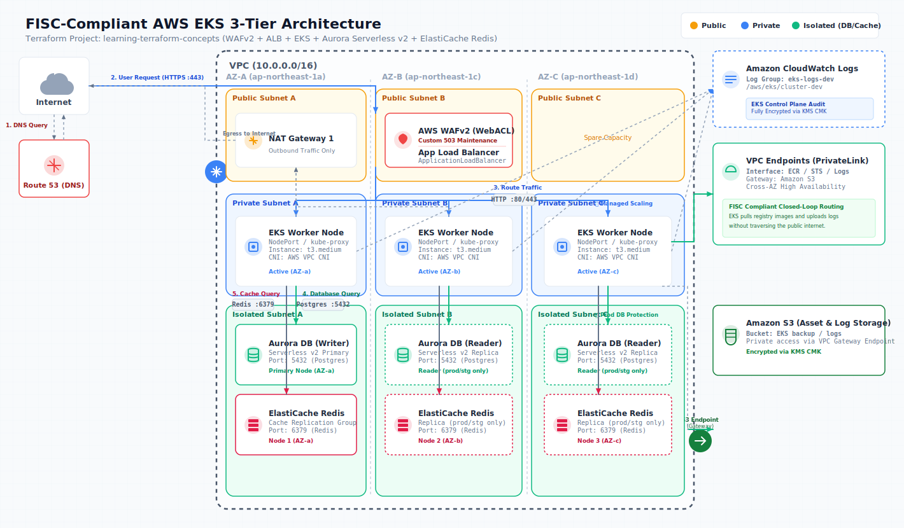
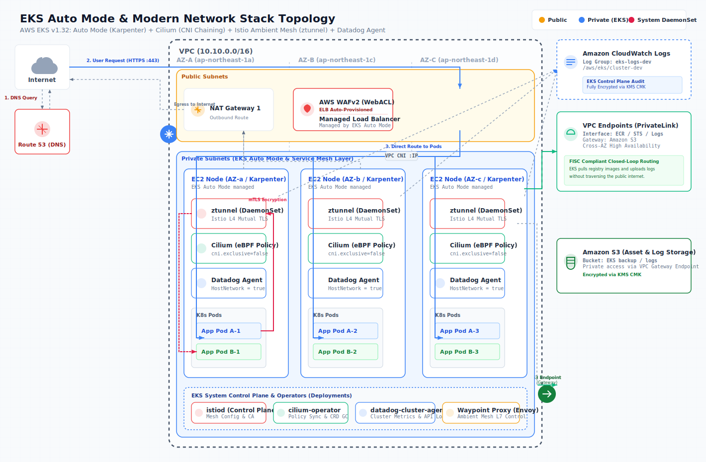

# learning-terraform-concepts

FISC安全対策基準に準拠した、セキュアで高可用性な AWS EKS 3層Webアプリケーションインフラをプレーンな Terraform (HCL) で定義したコードベースです。ポートフォリオ用として、金融機関等の厳しいセキュリティ要件を満たす設計パターンを実装しています。

---

## 📌 アーキテクチャ概要

本インフラは、パブリック、プライベート、およびインターネットから完全に分離されたアイソレート（孤立）の3つのレイヤーで構成されています。



---

## 🛡️ FISC安全対策基準に準拠したセキュリティ設計

金融・政府機関等のインフラで求められる **FISC（金融機関等コンピュータシステム安全対策基準）** に準拠するため、以下のインフラ制御を徹底しています。

### 1. 送信（Egress）の完全遮断
* **設計**: データベース（Aurora）およびキャッシュ（Redis）が配置されるアイソレートサブネット用のセキュリティグループにおいて、**送信（Egress）ルールを完全に排除**しています。
* **効果**: 万が一インフラ内でマルウェア感染や不正侵入が発生した場合でも、重要データが格納されたDB/キャッシュ層から外部へのデータ流出（C2サーバーへの通信など）を物理的・ネットワーク的に防ぎます。

### 2. 通信の暗号化の強制（Transit Encryption）
* **Aurora**: パラメータグループにて `rds.force_ssl = 1` を強制し、アプリケーションとのすべてのSQL通信をSSL/TLSで暗号化します。
* **ElastiCache Redis**: `transit_encryption_enabled = true` を設定し、インメモリキャッシュとの間のデータ転送も暗号化します。

### 3. カスタマー管理キー (CMK) によるデータ暗号化（At-Rest Encryption）
* **設計**: AWS管理のデフォルトキーではなく、KMS（Key Management Service）で作成した**カスタマー管理キー（CMK）**を使用しています。
* **対象**:
  * EKS Secrets（Kubernetes内のシークレットデータのエンベロープ暗号化）
  * RDS Auroraストレージ
  * ElastiCache Redis（保管時暗号化）
  * Secrets Manager（認証情報の暗号化）

### 4. 閉域接続の徹底（VPC Endpoints）
* **設計**: プライベートサブネットからAWSの各種マネージドサービス（ECR、S3、STS、CloudWatch Logs）へのアクセスは、NAT Gateway（インターネット）を経由させず、**プライベートVPCエンドポイント（Interface/Gateway型）**を経由させます。
* **効果**: インターネットを介さないため、中間者攻撃のリスクを低減し、耐障害性とセキュリティを高めます。

---

## 📁 フォルダ・モジュール構成

可読性と再利用性を高めるため、モノリスな記述を避け、役割ごとにモジュール化しています。

```text
learning-terraform-concepts/
  ├── .agents/                # AIエージェント（Antigravity）用設定フォルダ
  │     └── AGENTS.md         # プロジェクト専用のコーディング規約・FISC制約
  ├── providers.tf            # 各種プロバイダー（AWS, Kubernetes, Helm）の定義
  ├── variables.tf            # ルートレベルの変数宣言
  ├── outputs.tf              # インフラのアウトプット定義
  ├── main.tf                 # 各子モジュールの呼び出しと結合定義
  ├── terraform.tfvars        # 開発環境用の実パラメータ値
  └── modules/
        ├── vpc/              # VPC、3AZサブネット、NAT GW、VPCエンドポイント
        ├── security/         # KMS CMKの作成とポリシー管理
        ├── eks/              # EKSクラスター、Node Group、OIDC、ALB Controller
        ├── database/         # Aurora DB、Redis、認証情報、Egress空のSG
        └── waf/              # WAFv2 WebACL、IP制限、503メンテナンス画面定義
```

---

## ⚙️ WAFv2 による運用性設計

* **メンテナンスモード**:
  * 変数 `maintenance_mode = true` に設定することで、AWS WAFv2を通じて全てのトラフィックに対して即座にカスタムの503メンテナンス画面（HTML）を返却します。
  * 開発者や特定の関係者は、`waf_bypass_ip_cidrs` に送信元IPを指定することで、メンテナンス中もサービスへバイパスアクセスして検証を行える実用的な仕組みを実装しています。

---

## 🛠️ 検証コマンド

本リポジトリは構文・モジュール依存関係の検証が完了しています。

```powershell
# 1. 依存プロバイダーのダウンロードと初期化
terraform init

# 2. HCLコードのフォーマット整形
terraform fmt -recursive

# 3. 構文や参照関係の静的検証
terraform validate
```

## 🚀 初期セットアップ: リモートバックエンド（S3/DynamoDB）の構築

本プロジェクトは、複数人開発やデプロイ競合防止（ステートロック）を考慮し、S3とDynamoDBによるリモートバックエンド構成を採用しています。新規に構築を開始する際は、以下の「鶏と卵」問題をクリアするブートストラップ手順を実行してください。

### ステップ 1: バックエンド用リソースの作成（ローカル実行）

まず、ステート保存用のS3バケットと、ロック管理用のDynamoDBテーブルをローカル管理で作成します。

1. `bootstrap/` ディレクトリに移動します。
   ```bash
   cd bootstrap
   ```

2. 初期化とプロビジョニングを実行します（この時点のステートはローカルで一時管理されます）。
   ```bash
   terraform init
   terraform apply
   ```

3. 出力された `s3_bucket_name` と `dynamodb_table_name` をメモします。

### ステップ 2: メインインフラへのリモートバックエンド適用（移行）

作成したリソースをメインのインフラコードのバックエンドとして適用し、ステートファイルをS3へ移行します。

1. ルートディレクトリに戻ります。
   ```bash
   cd ..
   ```

2. `providers.tf` の `backend "s3"` ブロックに、先ほどメモしたS3バケット名とDynamoDBテーブル名を入力します。

3. 初期化コマンドを実行します。
   ```bash
   terraform init
   ```

4. ターミナルに 「ローカルのステートをリモートS3へ移行しますか？ (Do you want to copy existing state...)」 とメッセージが表示されるので、`yes` と入力します。

これで、初期セットアップは完了です。以降は安全なリモートバックエンド管理下で `terraform plan` / `apply` を実行できます。

---

## 🌟 [オプション] 最新モダン EKS Auto Mode 構成 (`eks-modern-auto/`)

本リポジトリの [`eks-modern-auto/`](file:///c:/Git/learning-terraform-concepts/eks-modern-auto/) ディレクトリには、AWS EKS（v1.32想定）の最新機能である **EKS Auto Mode** を土台とし、**Cilium (eBPF)**、**Istio Ambient Mesh (サイドカーレス)**、および **Datadog Agent (可観測性)** を統合した、次世代の Kubernetes インフラ基盤を構成する Terraform テンプレートを同梱しています。

金融・エンタープライズの堅牢性に加え、運用コストの極小化と圧倒的なネットワークパフォーマンスを両立させた「ベストプラクティス・スタック」を表現しています。

### 🚀 採用しているモダン技術スタックと選定理由

#### 1. 土台: EKS Auto Mode（Karpenter 自動管理）
* **選定理由**: 従来のノードグループ（MNG）管理を撤廃し、AWSが管理する **Karpenter** が直接EC2ノードのプロビジョニング、スケーリング、OS自動パッチを担います。
* **メリット**: ノード管理の手間がゼロになり、さらにロードバランサー（ELB）やブロックストレージ（EBS）のライフサイクルもEKSコントロールプレーンが自動管理するため、追加のインフラコントローラー（ALB ControllerやEBS CSI Driver等）の管理から解放されます。

#### 2. ネットワーク: Cilium（CNI Chaining モード）
* **選定理由**: カーネル内の **eBPF (Extended Berkeley Packet Filter)** を利用し、従来の `iptables` による重いパケット処理を回避した高速なコンテナ間通信とネットワークポリシー（L3/L4/L7）制御を提供します。
* **VPC CNI との調和 (Chaining Mode)**: EKS Auto Mode では標準で AWS VPC CNI が有効化されます。Ciliumを排他（Exclusive）モードで動かすとAuto Modeと競合するため、本構成では **`aws-vpc-cni` Chaining** を指定し、IPAMはVPC CNI、ポリシー制御とパケットフィルタリングはCiliumが担うハイブリッド設計としています。

#### 3. サービスメッシュ: Istio Ambient Mesh（サイドカーレス）
* **選定理由**: 従来のサイドカーモデル（Pod内にEnvoyコンテナを常駐させる）から進化し、ノード単位で動作する **`ztunnel` (DaemonSet)** と **`istio-cni`** を利用した**サイドカーレス・サービスメッシュ**を採用しています。
* **メリット**:
  * アプリケーションPodの起動順序問題を解消。
  * メモリ・CPU消費量を大幅に削減（サイドカーと比較して約50〜70%減）。
  * アプリケーションコードを変更せず、透過的な相互TLS（mTLS）暗号化およびL4テレメトリを即座に有効化。

#### 4. 監視: Datadog Agent（eBPF ネットワーク可観測性）
* **選定理由**: 各ノードに DaemonSet としてデプロイされ、ホストおよびコンテナのパフォーマンスを統合監視します。
* **最適化**: CiliumとIstio Ambientが稼働する複雑なネットワーク下で確実にパケットを監視するため、**`HostNetwork = true`** でエージェントを起動し、カーネルの **eBPF (System Probe / NPM)** を用いたリアルタイムなコンテナ間通信の接続関係とレイテンシを可視化します。

---

### 🛠️ アーキテクチャのトポロジー



---

### ⚙️ 主な設定パラメータ解説（`helm_releases.tf`）

#### Cilium (`cni.chainingMode = "aws-vpc-cni"`)
VPC CNIとのチェイニングを有効化するためのパラメータです。
```hcl
cni.chainingMode     = "aws-vpc-cni"
cni.exclusive        = "false"
enableIPv4Masquerade = "false" # VPC CNIがマスカレードを担当
tunnel               = "disabled" # トンネリング（VxLAN/Geneve）を無効化しVPCルーティングを利用
ipam.mode            = "aws-vpc-cni"
```

#### Istio Ambient Mesh (`profile = "ambient"`)
Ambient Meshを有効にするため、CRD、CNIプラグイン、コントロールプレーン、データプレーン（ztunnel）をそれぞれデプロイします。
* `istio-cni` が各ノードのネットワーク名前空間を監視し、アプリケーションのパケットを自動的かつ安全に `ztunnel` へリダイレクト（リダイレクション）します。

#### Datadog (`agents.useHostNetwork = true`)
CNIチェイニングおよびサービスメッシュが初期化されるよりも先に、ノードのホストネットワークにバインドして確実に起動し、メトリクスのドロップを防ぐ実務的（本番考慮）なパラメータです。

---

### 🚀 実行コマンド

本構成は静的検証が完了しています。

```bash
cd eks-modern-auto/
terraform init
terraform validate
```
