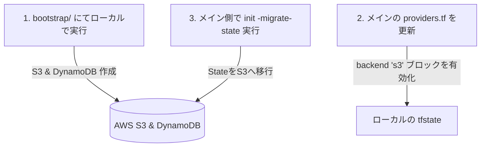

# Terraform リモートバックエンド・ブートストラップ (bootstrap/)

本ディレクトリ内のコードは、Terraform の状態（`.tfstate`）を安全に共同管理するための **S3 バケット（ステート保存用）** と **DynamoDB テーブル（同時実行ロック用）** 自体を自動作成するためのブートストラップ構成です。

---

## 🐣 「鶏と卵」の問題と解決アプローチ

### 問題の定義
Terraform でリモートバックエンドを構築する際、**「バックエンドリソース（S3/DynamoDB）を保存するためのバックエンドがまだ存在しない」** という循環依存（鶏と卵の問題）が発生します。最初から `backend "s3"` を指定して `terraform init` を実行しようとしても、そのバケット自体が未作成のためエラーになります。

### 解決方法
本プロジェクトでは、ライフサイクルを分割する **「2ステップ・ブートストラップ方式」** を採用してこの問題をクリーンに解決します。



---

## 🛠️ 作成されるリソース

本ブートストラップは、金融系などのセキュアな本番運用に耐えうるセキュリティ要件を満たす設計になっています。

1. **KMS カスタマー管理キー (CMK)**:
   * S3 バケットに保存されるステートファイルおよび DynamoDB テーブルの暗号化に使用します。
2. **S3 バケット (`learning-terraform-state-dev-<アカウントID>`)**:
   * **バージョニング有効**: 過去のステート履歴を保持し、万が一の破損時にも過去バージョンへロールバック可能です。
   * **完全非公開化 (Public Access Block)**: 意図しない外部露出を物理的にブロックします。
   * **KMS暗号化 (SSE-KMS)**: 保存された状態ファイルを強力に暗号化します。
   * **安全設計**: 開発環境用 (`dev`) では検証後にクリーンアップできるよう `force_destroy = true` に設定していますが、本番環境 (`prod`) の場合は `prevent_destroy = true` が有効化できるようライフサイクルが準備されています。
3. **DynamoDB テーブル (`learning-terraform-locks-dev`)**:
   * **オンデマンド課金 (PAY_PER_REQUEST)**: 使用した分のみ課金されるため、開発環境における無駄な維持費がゼロになります。
   * **パーティションキー**: `LockID` (S) を設定し、複数人が同時に実行した際の状態の破損（競合）を防止します。

---

## 🚀 移行ステップ (実行手順)

メインインフラのバックエンドをローカルから S3 + DynamoDB に移行する具体的な手順です。

### Step 1. ブートストラップを実行する (S3/DynamoDB の作成)
まず、本ディレクトリへ移動し、ローカル状態のままバックエンドリソースを作成します。

```bash
cd bootstrap/
terraform init
terraform apply
```

実行後、`outputs` として以下のようなバケット名等が出力されます。

```text
Outputs:
dynamodb_table_name = "learning-terraform-locks-dev"
state_bucket_name = "learning-terraform-state-dev-123456789012"
```

### Step 2. メインの backend 構成を変更する
ルートディレクトリに戻り、[`providers.tf`](../providers.tf) を開きます。
`backend "local"` ブロックをコメントアウト（または削除）し、出力された値を元に `backend "s3"` ブロックを有効化します。

```hcl
# ルートの providers.tf 修正例
terraform {
  # ... (省略) ...

  # ローカルバックエンドを無効化
  # backend "local" {
  #   path = "terraform.tfstate"
  # }

  # 作成されたリソースの情報を指定して有効化
  backend "s3" {
    bucket         = "learning-terraform-state-dev-123456789012" # outputsで出力されたバケット名
    key            = "dev/terraform.tfstate"
    region         = "ap-northeast-1"
    dynamodb_table = "learning-terraform-locks-dev"             # outputsで出力されたテーブル名
    encrypt        = true
  }
}
```

### Step 3. 状態ファイルをリモートへアップロード (移行) する
ルートディレクトリ（プロジェクトのルート）で以下のコマンドを実行します。

```bash
cd ..
terraform init -migrate-state
```

実行中に以下のようにローカルステートをS3に移行するか確認を求められます。

```text
Do you want to copy existing state to the new backend?
  Pre-existing state was found while migrating the previous "local" backend to the
  newly configured "s3" backend. No existing state was found in the "s3" backend.
  Do you want to copy this state to the new "s3" backend? Enter "yes" to copy and "no"
  to start with an empty state.

  Enter a value: yes
```

**`yes`** と入力すると、ローカルの `terraform.tfstate` が S3 に安全に転送されます。

---

## 🔒 セキュリティおよび Git 管理 (.gitignore)

ローカルの不要なファイルや機密情報が誤って Git (GitHub) にプッシュされないよう、プロジェクトのルートにある [`.gitignore`](../.gitignore) にて以下を完全に除外しています。

```gitignore
# ローカルキャッシュディレクトリ (bootstrap/ 内のキャッシュも再帰的に除外されます)
**/.terraform/*

# ローカルの状態ファイル (移行後は不要になります)
*.tfstate
*.tfstate.*

# 環境変数やシークレットを含むローカルパラメータファイル
*.tfvars
*.tfvars.json
```
