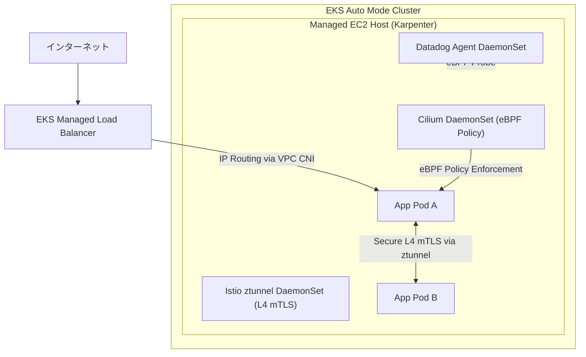

# EKS Auto Mode & Modern Network Stack Configuration (eks-modern-auto/)

本ディレクトリ内のコードは、AWS EKS（v1.32想定）の最新機能である **EKS Auto Mode** を土台とし、**Cilium (eBPF)**、**Istio Ambient Mesh (サイドカーレス)**、および **Datadog Agent (可観測性)** を統合した、次世代の Kubernetes インフラ基盤を構成する Terraform テンプレートです。

金融・エンタープライズの堅牢性に加え、運用コストの極小化と圧倒的なネットワークパフォーマンスを両立させた「ベストプラクティス・スタック」を表現しています。

---

## 🚀 採用しているモダン技術スタックと選定理由

### 1. 土台: EKS Auto Mode（Karpenter 自動管理）
* **選定理由**: 従来のノードグループ（MNG）管理を撤廃し、AWSが管理する **Karpenter** が直接EC2ノードのプロビジョニング、スケーリング、OS自動パッチを担います。
* **メリット**: ノード管理の手間がゼロになり、さらにロードバランサー（ELB）やブロックストレージ（EBS）のライフサイクルもEKSコントロールプレーンが自動管理するため、追加のインフラコントローラー（ALB ControllerやEBS CSI Driver等）の管理から解放されます。

### 2. ネットワーク: Cilium（CNI Chaining モード）
* **選定理由**: カーネル内の **eBPF (Extended Berkeley Packet Filter)** を利用し、従来の `iptables` による重いパケット処理を回避した高速なコンテナ間通信とネットワークポリシー（L3/L4/L7）制御を提供します。
* **VPC CNI との調和 (Chaining Mode)**: EKS Auto Mode では標準で AWS VPC CNI が有効化されます。Ciliumを排他（Exclusive）モードで動かすとAuto Modeと競合するため、本構成では **`aws-vpc-cni` Chaining** を指定し、IPAMはVPC CNI、ポリシー制御とパケットフィルタリングはCiliumが担うハイブリッド設計としています。

### 3. サービスメッシュ: Istio Ambient Mesh（サイドカーレス）
* **選定理由**: 従来のサイドカーモデル（Pod内にEnvoyコンテナを常駐させる）から進化し、ノード単位で動作する **`ztunnel` (DaemonSet)** と **`istio-cni`** を利用した**サイドカーレス・サービスメッシュ**を採用しています。
* **メリット**:
  * アプリケーションPodの起動順序問題を解消。
  * メモリ・CPU消費量を大幅に削減（サイドカーと比較して約50〜70%減）。
  * アプリケーションコードを変更せず、透過的な相互TLS（mTLS）暗号化およびL4テレメトリを即座に有効化。

### 4. 監視: Datadog Agent（eBPF ネットワーク可観測性）
* **選定理由**: 各ノードに DaemonSet としてデプロイされ、ホストおよびコンテナのパフォーマンスを統合監視します。
* **最適化**: CiliumとIstio Ambientが稼働する複雑なネットワーク下で確実にパケットを監視するため、**`HostNetwork = true`** でエージェントを起動し、カーネルの **eBPF (System Probe / NPM)** を用いたリアルタイムなコンテナ間通信の接続関係とレイテンシを可視化します。

---

## 🛠️ アーキテクチャのトポロジー



---

## ⚙️ 主な設定パラメータ解説（helm_releases.tf）

### Cilium (cni.chainingMode = "aws-vpc-cni")
VPC CNIとのチェイニングを有効化するためのパラメータです。
```hcl
cni.chainingMode     = "aws-vpc-cni"
cni.exclusive        = "false"
enableIPv4Masquerade = "false" # VPC CNIがマスカレードを担当
tunnel               = "disabled" # トンネリング（VxLAN/Geneve）を無効化しVPCルーティングを利用
ipam.mode            = "aws-vpc-cni"
```

### Istio Ambient Mesh (profile = "ambient")
Ambient Meshを有効にするため、CRD、CNIプラグイン、コントロールプレーン、データプレーン（ztunnel）をそれぞれデプロイします。
* `istio-cni` が各ノードのネットワーク名前空間を監視し、アプリケーションのパケットを自動的かつ安全に `ztunnel` へリダイレクト（リダイレクション）します。

### Datadog (agents.useHostNetwork = true)
CNIチェイニングおよびサービスメッシュが初期化されるよりも先に、ノードのホストネットワークにバインドして確実に起動し、メトリクスのドロップを防ぐ実務的（本番考慮）なパラメータです。

---

## 🚀 実行コマンド

本構成は静的検証が完了しています。

```bash
cd eks-modern-auto/
terraform init
terraform validate
```
